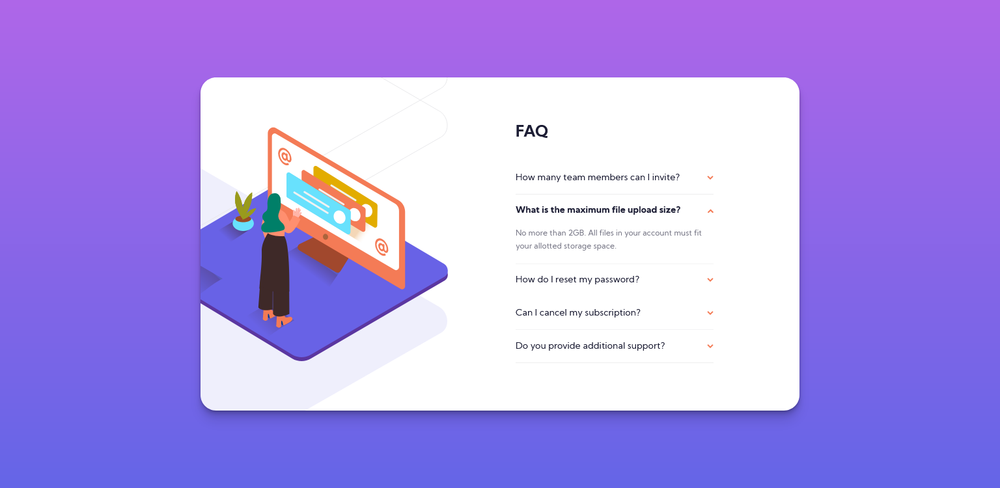

# Frontend Mentor - FAQ Accordion Card Solution

This is a solution to the [FAQ Accordion Card Challenge on Frontend Mentor](https://www.frontendmentor.io/challenges/faq-accordion-card-XlyjD0Oam). Frontend Mentor challenges help you improve your coding skills by building realistic projects.

## Table of contents

- [Overview](#overview)
  - [The challenge](#the-challenge)
  - [Screenshot](#screenshot)
  - [Links](#links)
- [My process](#my-process)
  - [Built with](#built-with)
  - [What I learned](#what-i-learned)
  - [Continued development](#continued-development)
- [Author](#author)

## Overview

### The challenge

The [challenge](https://www.frontendmentor.io/challenges/profile-card-component-cfArpWshJ) was to build out the FAQ accordion card and get it looking as close to the design as possible.

Users should be able to:

- View the optimal layout for the component depending on their device's screen size.
- See hover states for all interactive elements on the page.
- Hide/Show the answer to a question when the question is clicked.

### Screenshot

### Links

- Frontend Mentor Solution
- [Live Site](https://likelytwitchdollop.github.io/faq-accordion-card/)

## My process

### Built with

HTML5 + CSS | Flexbox + Grid | CSS Grid using a mobile-first workflow.

### What I learned

Major learnings while working on this project were:

- Positioning illustrations can be a tricky.

### Continued development

This solution is still a WIP, for the following reasons:

- On the desktop design, the box illustration is missing.
- The design for screens smaller than 320px may require some tweaking.

Attempting this challenge highlighted some areas I would like to continue perfecting:

- Designing for screens smaller than 320px, which often requires a bit of creativity if a design is not provided.

## Author

- Frontend Mentor - [@likelytwitchdollop](https://www.frontendmentor.io/profile/likelytwitchdollop)
